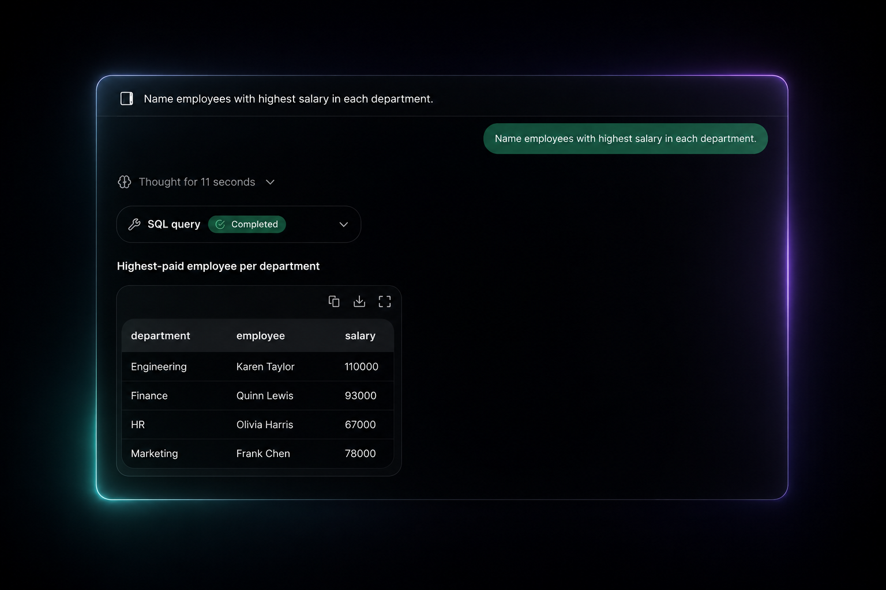

# Sqliqs

**Ask your database in plain English — get answers, charts, and reports. No SQL, no setup.**

Sqliqs is a bring-your-own-key (BYOK), local-first tool for querying any database in natural language. Connect a database, ask a question the way you'd say it out loud, and Sqliqs writes the read-only query, runs it, and answers — with a result table, an instant chart, a full written report, or an auto-generated ER diagram.

<p align="center">
  
</p>

## Features

- **💬 Chat with your data** — ask questions and follow-ups, get a plain-English answer alongside the generated query and result table. History is saved locally.
- **📊 Visualize instantly** — describe what you want to see; Sqliqs picks the chart type and fills it with your data.
- **📄 Full reports** — ask for a report in one sentence and get a formatted document with narrative, tables, and embedded charts.
- **🗺️ ER diagrams** — every connected database gets an auto-generated schema map you can export as SVG or PNG.
- **🔒 Read-only by design** — every generated query is read-only; Sqliqs can't insert, update, or delete.
- **🔑 Bring your own key** — use your own model provider key (or the built-in free model). Your keys and connection strings live only in your browser.
- **🧪 Public Playground** — try the whole product against a hosted sample database with no login and no key.

## Supported databases & providers

| Databases | AI providers |
| --- | --- |
| PostgreSQL · MySQL/MariaDB · SQLite (incl. Turso) · MongoDB | OpenRouter (free model) · Anthropic · OpenAI · Google · xAI · DeepSeek |

## How it works

1. **Connect** a database with a connection string (stays in your browser).
2. **Pick a model** and bring your key — or start with the built-in free model.
3. **Ask** in plain English. Sqliqs reads your schema and writes the read-only query.
4. **Get** answers, charts, reports, and diagrams.

There are no accounts. Projects, settings, chat history, keys, and connection strings are stored locally in the browser (IndexedDB). Per request, your connection string and key are sent over HTTPS to execute the query and call your chosen model — never persisted or logged server-side.

## Tech stack

- **[Next.js 16](https://nextjs.org)** (App Router, React 19) on **[Bun](https://bun.sh)**
- **[Vercel AI SDK v6](https://sdk.vercel.ai)** with native provider clients
- **Tailwind CSS v4** + **[shadcn/ui](https://ui.shadcn.com)**, **[Streamdown](https://streamdown.ai)** for markdown, **[Recharts](https://recharts.org)** for charts, **[React Flow](https://reactflow.dev)** for ER diagrams
- **[IndexedDB](https://developer.mozilla.org/docs/Web/API/IndexedDB_API)** (via `idb`) for local-first storage
- Database drivers: `pg`/`postgres`, `mysql2`, `@libsql/client`, `mongodb`

## Getting started

**Prerequisites:** [Bun](https://bun.sh) (`v1.3+`).

```bash
# 1. Install dependencies
bun install

# 2. Configure environment (see below)
cp .env.example .env.local   # then fill in the values

# 3. Seed the sample database used by the Playground
bun seed

# 4. Start the dev server
bun dev
```

Open [http://localhost:3000](http://localhost:3000).

### Environment variables

| Variable | Required | Purpose |
| --- | --- | --- |
| `DATABASE_URL` | ✅ | Connection string for the Playground's sample database. Use a **read-only** role at runtime. |
| `SEED_DATABASE_URL` | for seeding | Owner/write role used by `bun seed`. Falls back to `DATABASE_URL` if unset. |
| `OPENROUTER_API_KEY` | ✅ | Key for the built-in free model the Playground uses. |
| `OPENROUTER_DEFAULT_MODEL` | optional | Override the default free model id. |

> User-supplied keys for their own projects are entered in the UI and stored only in the browser — they are never read from the environment.

## Scripts

| Command | Description |
| --- | --- |
| `bun dev` | Start the dev server |
| `bun run build` | Production build |
| `bun start` | Run the production build |
| `bun run lint` | Lint with ESLint |
| `bun seed` | (Re)seed the sample database |

## Project structure

```
app/            Routes — landing, /playground, /dashboard, /projects, /settings, content pages, /api
components/     UI — landing/, dashboard/, project/, chat/, visualization/, reports/, er-diagram/, brand/
content/        Markdown for the Guide, Pricing, and Privacy pages
lib/
  ai/           Provider seam, model catalog, prompts, tools
  db/           Per-engine adapters (postgres, mysql, sqlite, mongo) behind one interface
  store/        IndexedDB stores (projects, settings, sessions)
public/         Logos, provider/database icons, feature screenshots
seed.ts         Idempotent sample-data seeder
```

## Privacy & security

- No accounts, no tracking — see the in-app [Privacy Policy](content/privacy.md).
- Keys and connection strings never leave the browser except per-request over TLS; nothing is persisted or logged server-side.
- All generated queries are read-only. For defense in depth, connect with a database role that only has `SELECT`.

---

Built with Next.js, the Vercel AI SDK, and Claude.
